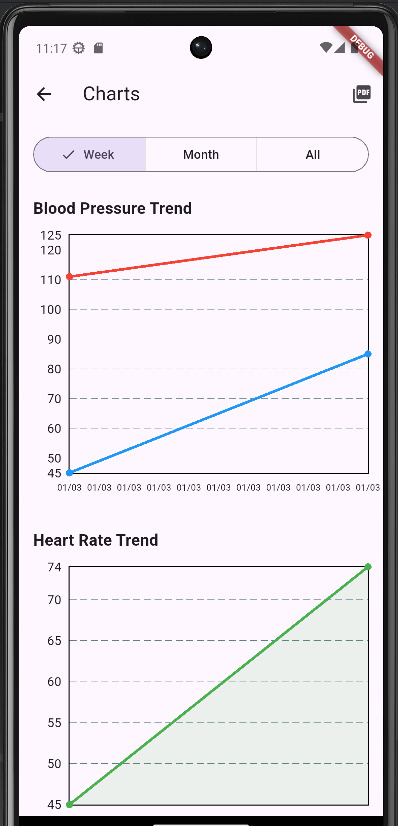
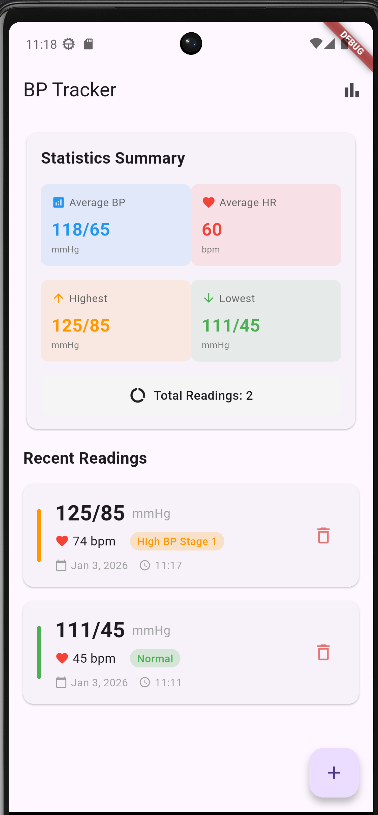

# Blood Pressure Tracker (BP Tracker)

A Flutter mobile application for tracking blood pressure readings with charts, analytics, and PDF export capabilities.

## Features

- 📊 **Track Readings**: Record blood pressure (systolic/diastolic), heart rate, date/time, and notes
- 📈 **Visualize Trends**: Interactive charts showing blood pressure and heart rate trends over time
- 📄 **Export Reports**: Generate PDF reports to share with healthcare providers
- 💾 **Local Storage**: All data stored locally using SQLite - no cloud, complete privacy
- 🎨 **Clean UI**: Modern Material Design 3 interface
- ⚡ **Fast Performance**: Optimized for smooth performance with large datasets

## Screenshots

### Main Screen with Records


*Home screen showing blood pressure readings with statistics summary and recent records list*

### Charts and Analytics


*Interactive charts displaying blood pressure trends and heart rate over time*

## Getting Started

### Prerequisites

- Flutter SDK 3.24+ ([Installation Guide](https://docs.flutter.dev/get-started/install))
- Android Studio with Android SDK (API 24+)
- VS Code with Flutter/Dart extensions (recommended) or Android Studio

### Installation

1. **Clone the repository**
   ```bash
   git clone git@github.com:jpabloglez/bpf-app.git
   cd bpf-app
   ```

2. **Install dependencies**
   ```bash
   flutter pub get
   ```

3. **Run the app**
   ```bash
   # On emulator
   flutter run

   # On physical device (USB debugging enabled)
   flutter run -d <device-id>
   ```

### Quick Setup

If you're new to Flutter, follow these steps:

1. Install Flutter SDK following the [official guide](https://docs.flutter.dev/get-started/install)
2. Run `flutter doctor` to verify your setup
3. Accept Android licenses: `flutter doctor --android-licenses`
4. Clone this repo and run `flutter pub get`
5. Connect a device or start an emulator
6. Run `flutter run`

## Documentation

Comprehensive documentation is available in the `docs/` folder:

- **[Documentation Index](docs/README.md)** - Start here
- **[Technology Stack](docs/01-technology-stack.md)** - Technologies used and why
- **[Development Setup](docs/02-development-setup.md)** - Complete setup guide
- **[Testing Guide](docs/03-testing-guide.md)** - Testing on emulators and physical devices
- **[Deployment Guide](docs/04-deployment-guide.md)** - Building and deploying to Play Store
- **[Feature Implementation](docs/05-feature-implementation.md)** - Code implementation details

## Project Structure

```
lib/
├── main.dart                   # App entry point
├── models/                     # Data models
│   ├── blood_pressure_reading.dart
│   └── reading_statistics.dart
├── services/                   # Business logic
│   ├── database_service.dart   # SQLite operations
│   └── pdf_service.dart        # PDF generation
├── providers/                  # State management
│   └── readings_provider.dart
├── screens/                    # UI screens
│   ├── home_screen.dart
│   ├── add_reading_screen.dart
│   └── charts_screen.dart
└── widgets/                    # Reusable components
    ├── reading_card.dart
    ├── statistics_card.dart
    └── (chart widgets in screens)
```

## Technology Stack

- **Framework**: Flutter 3.24+
- **Language**: Dart 3.5+
- **Database**: SQLite (sqflite)
- **Charts**: fl_chart
- **PDF**: pdf + printing packages
- **State Management**: Provider
- **Platform**: Android 7.0+ (API 24+)

## Building for Release

### APK (for direct distribution)

```bash
flutter build apk --release
```

Output: `build/app/outputs/flutter-apk/app-release.apk`

### App Bundle (for Play Store)

```bash
flutter build appbundle --release
```

Output: `build/app/outputs/bundle/release/app-release.aab`

See [Deployment Guide](docs/04-deployment-guide.md) for detailed instructions on signing and publishing.

## Testing

### Run tests

```bash
# Unit tests
flutter test

# Integration tests
flutter test integration_test/

# With coverage
flutter test --coverage
```

### Manual testing

See [Testing Guide](docs/03-testing-guide.md) for instructions on:
- Setting up emulators
- Testing on physical devices (USB debugging)
- Manual testing checklist

## Contributing

This is a personal project, but suggestions and feedback are welcome! Feel free to open an issue or submit a pull request.

## Privacy

- **100% Local**: All data stored on your device
- **No Cloud**: No data transmission to external servers
- **No Analytics**: No tracking or telemetry
- **No Ads**: Completely ad-free

## License

This project is open source and available under the MIT License.

## Roadmap

Future enhancements (optional):
- [ ] Medication tracking
- [ ] Reminders for measurements
- [ ] Data backup/restore to file
- [ ] Multiple user profiles
- [ ] Advanced analytics (weekly/monthly trends)
- [ ] Dark mode theme

## Support

For issues or questions:
- Check the [documentation](docs/README.md)
- Review [common issues](docs/03-testing-guide.md#common-issues)
- Open an issue on GitHub

## Acknowledgments

- Built with [Flutter](https://flutter.dev/)
- Charts by [fl_chart](https://pub.dev/packages/fl_chart)
- PDF generation using [pdf](https://pub.dev/packages/pdf) and [printing](https://pub.dev/packages/printing)

---

**Disclaimer**: This app is for informational purposes only and is not a substitute for professional medical advice. Always consult your healthcare provider about your blood pressure.
